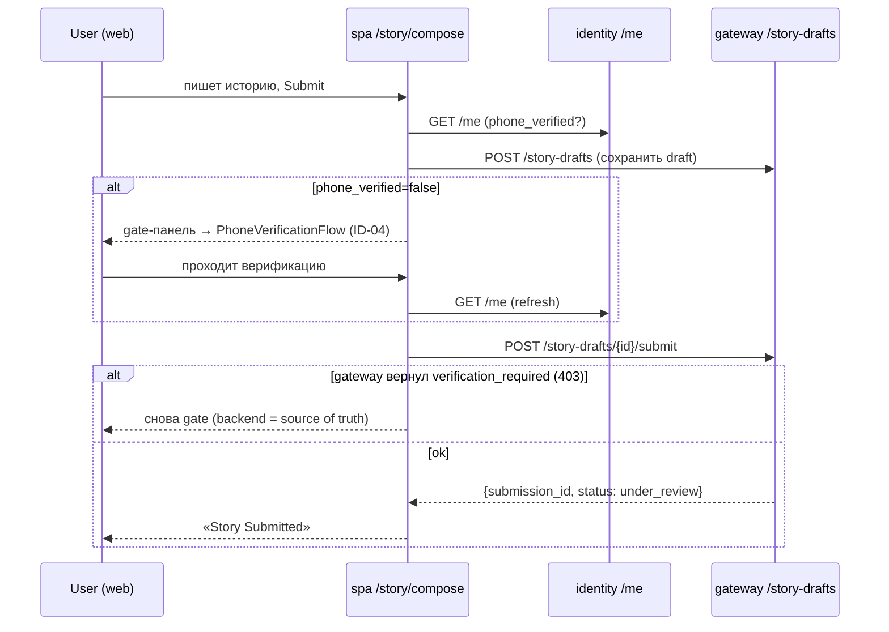
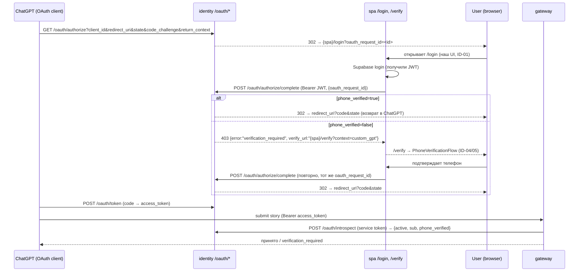

# GPT-редирект, OAuth-авторизация и отправка истории — флоу и контракты

> Как устроены **две двери** к «отправить гражданскую историю» и где включается UI, построенный в EPIC-SPA-04.
> Сверено с кодом (2026-06-29): identity `src/core/oauth/*`, spa `src/pages/*`, `src/services/storyDraftService.js`.
> Связано: стори [ID-08 GPT Verification Entry](../tasks/backlog-stories/identity-auth/STORY-SPA-ID-08-gpt-verification-entry.md), [ID-06 Protected Action Gate](../tasks/backlog-stories/identity-auth/STORY-SPA-ID-06-protected-action-gate.md); анализ [identity-auth-api-validation-2026-06-27](../analysis/identity-auth-api-validation-2026-06-27.md), [identity-gateway-integration-notes-2026-06-23](../analysis/identity-gateway-integration-notes-2026-06-23.md).

---

## 0. TL;DR — не путать два «редиректа»

| | **Дверь A — Web lazy-gate** | **Дверь B — GPT bridge (OAuth)** |
|---|------------------------------|----------------------------------|
| Откуда стартует | Пользователь на **нашем** сайте `/story/compose` | Пользователь в **ChatGPT** (Custom GPT) |
| «Редирект» | Внутренняя смена экранов SPA (не внешний переход) | **Внешний** редирект ChatGPT → наш `/login` → назад в ChatGPT |
| Где UI | `/story/compose` гейт (ID-06) | `/login` + `/verify` (ID-01/04/05) |
| Что отправляет историю | Наш SPA → gateway `POST /story-drafts/{id}/submit` | **ChatGPT** → gateway (с OAuth-токеном), сервер↔сервер |
| Когда показывается верификация | На Submit, если `phone_verified=false` | На этапе **OAuth-авторизации** (до возврата в ChatGPT) |
| Статус кода | ✅ построено (pkg-000021) | 🔶 backend OAuth готов; **SPA-склейка = ID-08, ещё не реализована** |

**Главное:** в двери B наш UI и редирект включаются на шаге **авторизации/верификации**, а **не** на самом «сабмите истории». Сам сабмит из GPT идёт в gateway с уже выданным токеном (наш UI там не участвует).

---

## 1. Дверь A — Web lazy-gate (ID-06, построено)

Пользователь пишет историю у нас и отправляет. Верификация — лениво, на Submit.

Код: [StoryComposePage.jsx](../../src/pages/StoryComposePage.jsx), [storyDraftService.js](../../src/services/storyDraftService.js). «Редирект» здесь = смена `STORY_GATE_PHASES` (внутри SPA), внешнего перехода нет.

---

## 2. Дверь B — GPT bridge через OAuth (ID-08, план; backend готов)

Пользователь в ChatGPT; чтобы отправить историю, GPT должен получить OAuth-токен, привязанный к **подтверждённому** человеку. Это **OAuth 2.0 Authorization Code + PKCE**.

### 2.1 Шаги словами
1. **GPT → `/oauth/authorize`** — identity валидирует клиента/redirect_uri, создаёт `oauth_request_id`, **302** на `{spa}/login?oauth_request_id=<id>` ([handlers.py:28-99](../../../doge-identity-service/src/core/oauth/handlers.py), [spa_login.py](../../../doge-identity-service/src/core/oauth/spa_login.py)).
2. **SPA `/login`** — логин/регистрация через Supabase (reuse ID-01). С JWT SPA вызывает **`POST /oauth/authorize/complete`** с `{oauth_request_id}`.
3. **Ответ `/oauth/authorize/complete`** ([handlers.py:102-153](../../../doge-identity-service/src/core/oauth/handlers.py)):
   - `phone_verified=true` → **302** `redirect_uri?code=…&state=…` (возврат в ChatGPT);
   - `phone_verified=false` → **HTTP 403**, тело **плоское** `{"error":"verification_required","reason":"…","verify_url":"{spa}/verify?context=<ctx>"}` ([verification_required.py](../../../doge-identity-service/src/core/oauth/verification_required.py)).
4. **SPA на 403** — идёт на `verify_url` (`/verify?context=custom_gpt`), проводит phone-flow (reuse ID-04/05), затем **повторяет** `/oauth/authorize/complete` → теперь 302 с кодом.
5. **GPT → `/oauth/token`** — обменивает `code` на `access_token` ([handlers.py:156-197](../../../doge-identity-service/src/core/oauth/handlers.py)).
6. **GPT → gateway** — отправляет историю с `access_token`; gateway проверяет токен через **`POST /oauth/introspect`** и энфорсит verification на своей стороне.

### 2.2 Already-verified
Если на шаге 3 `phone_verified` уже true (или человек верифицировался ранее) — `/complete` сразу отдаёт код, экран «You're ready», без `/verify`.

---

## 3. Контракт сервера (identity) — **построено**

Все 4 эндпоинта зарегистрированы ([asgi_app.py:408-454](../../../doge-identity-service/src/core/api/asgi_app.py)):

| Endpoint | Вход | Выход |
|----------|------|-------|
| `GET /oauth/authorize` | `response_type=code,client_id,redirect_uri,state,code_challenge,code_challenge_method=S256,scope,requested_action,return_context` | **302** → `{spa}/login?oauth_request_id` (или RFC6749 `{error,error_description}` при ошибке клиента) |
| `POST /oauth/authorize/complete` | Bearer Supabase JWT + `{oauth_request_id}` | **302** `redirect_uri?code&state` \| **403** плоский `{error:"verification_required",reason,verify_url}` |
| `POST /oauth/token` | `grant_type,code,client_id,client_secret,redirect_uri,code_verifier` | `{access_token, token_type:"Bearer", expires_in}` (RFC6749 ошибки) |
| `POST /oauth/introspect` | service-token + `{token}` | `{active, sub, phone_verified}` (для gateway) |

> ⚠️ **Два разных формата ошибок:** OAuth-эндпоинты — RFC6749 (`{error, error_description}`) и плоский `verification_required` (403). А `/me`, `/auth/phone/*` — конверт `{"error":{"code","message","trace_id"}}`. SPA-клиент должен ветвиться по shape.

---

## 4. Ожидания: от GPT, от сервера, от SPA, от gateway

### От **Custom GPT** (OAuth-клиент) — ops/ChatGPT
- Зарегистрирован как OAuth-клиент в identity (известны `client_id`, `redirect_uri`, secret для `/token`).
- Открывает `/oauth/authorize` с PKCE (`code_challenge`), `state`, и `return_context` (напр. `custom_gpt`).
- Принимает возврат на `redirect_uri?code&state`, меняет `code` на токен через `/oauth/token`.
- Отправляет историю в **gateway** с `Bearer access_token`.
- Если потребовалась верификация (через нашу страницу) — после возврата корректно продолжает (повторный authorize не нужен: SPA сама повторяет `/complete`).
- **Никогда** не получает пароль/номер/OTP — они только на нашем web.

### От **identity-сервера** — ✅ построено (OAUTH-01…04)
- `/oauth/authorize` → 302 на `{spa}/login?oauth_request_id` (база `{spa}` = первый origin из `CORS_ALLOWED_ORIGINS`, [spa_login.py:7-18](../../../doge-identity-service/src/core/oauth/spa_login.py)).
- `/oauth/authorize/complete` → 302 code | 403 `verification_required`+`verify_url`.
- `/oauth/token`, `/oauth/introspect` — как в §3.
- `{spa}` origin SPA должен быть в `CORS_ALLOWED_ORIGINS` identity.

### От **SPA** — 🔶 ID-08 (ещё не реализовано; reuse готовых ID-01/04/05/03)
- `/login` читает `oauth_request_id` (query) → после Supabase-логина вызывает `POST /oauth/authorize/complete`.
- Ветвление ответа: 302 (браузер сам уйдёт в ChatGPT) vs 403 → навигировать на `verify_url`.
- `/verify?context=custom_gpt` → phone-flow → по успеху **повторить** `/complete`.
- Экраны «Return to ChatGPT» / «You're ready» (`gptBridge.*` строки — в [ID-08 §Тексты](../tasks/backlog-stories/identity-auth/STORY-SPA-ID-08-gpt-verification-entry.md)).
- **Текущее состояние (grep по `src/`):** `oauth_request_id` / `/oauth/authorize/complete` / `gptBridge` в spa **отсутствуют** → дверь B end-to-end пока не кликабельна; backend и переиспользуемые экраны готовы.

### От **gateway** (doge-complaints-gateway) — отдельный репо
- На submit истории из GPT: `POST /oauth/introspect` (service-token) → `{active, sub, phone_verified}`; энфорс `verification_required` на своей стороне.
- Веб-путь (дверь A): `POST /story-drafts`, `POST /story-drafts/{id}/submit`, и формат ответа `verification_required` — контракт в [integration-notes](../analysis/identity-gateway-integration-notes-2026-06-23.md). **На стороне SPA клиент готов и mock-тестирован; live-эндпоинты — работа gateway.**

---

## 5. Маршруты SPA, участвующие во флоу

| Route | Дверь | Назначение | Статус |
|-------|-------|-----------|--------|
| `/story/compose` | A | web-гейт compose→verify→submit | ✅ ID-06 |
| `/login?oauth_request_id=<id>` | B | точка входа OAuth-handshake | 🔶 ID-08 (читать query — TODO) |
| `/verify?context=custom_gpt` | B | ветка `verification_required` | 🔶 ID-08 (VerifyPage пока не читает `context`) |
| `/login`, `/verify`, `/dashboard` | оба | переиспользуемые экраны | ✅ ID-01/04/05/03 |

---

## 6. Частые вопросы

- **«При сабмите истории идёт редирект на наш UI?»** — В двери B нет: сабмит GPT→gateway идёт с токеном, сервер↔сервер. Редирект на наш UI происходит раньше — на этапе **OAuth-авторизации** (которая и нужна, чтобы получить verified-токен). В двери A «редирект» — внутренняя смена экранов SPA.
- **«Зачем два захода `/oauth/authorize/complete`?»** — Первый может вернуть 403 (нужна верификация). После phone-flow SPA повторяет тот же `oauth_request_id` — второй заход возвращает код.
- **«Где пользователь вводит пароль/код?»** — Только на нашем web (`/login`, `/verify`). GPT их не видит.

---

*Сверено с фактическим кодом identity (`oauth/handlers.py`, `spa_login.py`, `verification_required.py`, `asgi_app.py`) и spa (`StoryComposePage.jsx`, `storyDraftService.js`, отсутствие oauth-glue в `src/`). Дверь B (SPA-склейка) — план ID-08; backend OAuth и переиспользуемые экраны — готовы.*
